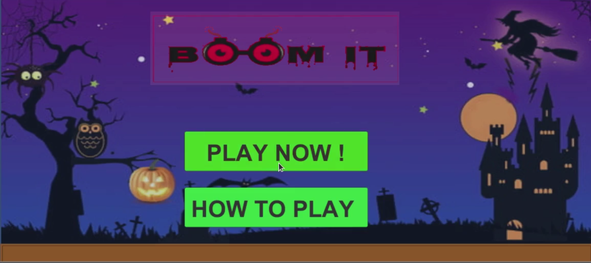

# BOOM IT - 2D Game on Unity

## Unity Version 20198.4.29f1

Game Play - User has to disintegrate a site using minimum resources. There will be various bombs types like dynamites, sky-drop bombs, TNT, grenades, etc.made available to the user to disintegrate a site into pieces. To pass a certain level every monster at the site needs to go to hell (touch ground). Game play will based on natural physics laws (like
gravity), and also user will have to minimize bomb usage and create maximum destruction.
There will be levels with increasing difficulty in the game play.

